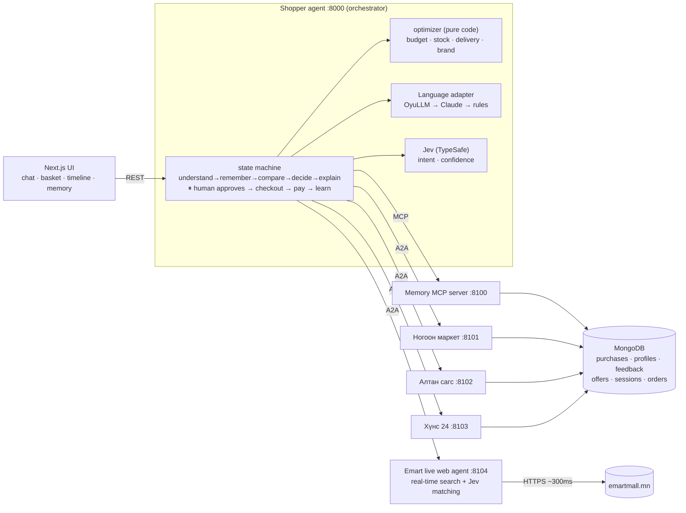

# Сагс — хувийн худалдан авалтын агент

A shopping agent that works **for the user**, remembers what they buy, compares stores and checks out only after the user approves.
Built for the **Agentic Commerce Hackathon 2026** (Novelsoft × Applied AI Mongolia). Requirements covered: **OyuLLM** (language adapter), **MongoDB** (memory + catalog + audit), **MCP** (memory server, store tools), plus **A2A** between agents and **Jev** as the decision model.

## Architecture



- **Every store is an independent agent process** with an A2A card (`/.well-known/agent-card.json`) **and** the same capabilities as MCP tools (`/mcp`). A new store = a new backend with 5 methods; the Shopper code does not change.
- **Emart agent** searches the real emartmall.mn catalog live, then asks **Jev** (one batched call) which result is really the product: "авокадо" returns only avocado *oil*, and Jev rejects it (P(none)=1.0). Comparison only, no checkout.
- **Money rules are code, not LLM** (`sags/shopper/optimizer.py`, unit-tested). The LLM only parses the request and explains the decision.
- **Human in the loop:** nothing is paid until the user approves the basket and pays the QR invoice.
- **The agent learns:** removed items lower that product's weight; purchases update habits via a MongoDB aggregation.

## Run it

Needs Python ≥ 3.12, Node ≥ 20.9, and a MongoDB (Atlas free M0 is fine).

```bash
cp .env.example .env            # fill MONGODB_URI, TYPESAFE_API_KEY, ANTHROPIC_API_KEY (optional)

# backend
cd backend
python3 -m venv .venv && .venv/bin/pip install -e ".[dev]"
.venv/bin/python -m sags.seed   # deterministic demo data (resets the DB)
.venv/bin/python -m sags.dev    # memory MCP + 4 store agents + shopper API
.venv/bin/pytest                # optimizer + memory tests

# frontend (new terminal)
cd frontend && npm install && npm run dev   # http://localhost:3000
```

No LLM key? It still works: the rule-based parser handles "150к-д бэлд, өндөг нэм". On hackathon day set `OYULLM_BASE_URL` / `OYULLM_API_KEY` and OyuLLM takes over.

## Demo script (3 min)

1. The memory panel shows habits: cabbage every 14 days, cucumber every 7… with due scores.
2. Type **«Энэ долоо хоногийн сагсаа 50к-д бэлд, өндөг нэм»** → the timeline fills live: Jev intent → Memory MCP (7 due items) → A2A cards → 4 quotes in parallel (Emart live with Jev confidence) → optimizer → explanation.
3. The proposal shows the cheapest store incl. delivery, the comparison bars, Emart reference prices, and the item dropped to fit the budget.
4. Untick one item → **Батлах** → A2A checkout → QR invoice → **Төлсөн** → A2A order confirmed.
5. The memory panel updates: the bought items reset to 0, and the removed item shows weight 0.6 and drops out of suggestions.

## Try the protocols directly

```bash
curl localhost:8101/.well-known/agent-card.json                       # A2A card
curl -X POST localhost:8104/ -H 'Content-Type: application/json' -d '{"jsonrpc":"2.0","id":1,"method":"message/send",
  "params":{"message":{"role":"user","messageId":"1","parts":[{"kind":"data","data":{"skill":"search_products","input":{"query":"сүү"}}}]}}}'
npx @modelcontextprotocol/inspector   # connect to http://127.0.0.1:8100/mcp (memory) or :8101/mcp (store)
```

## Layout

```
backend/sags/
  contracts.py        ← THE team contract (pydantic). Agree before changing.
  a2a.py              A2A card + JSON-RPC server/client
  jev.py              Jev decision calls (intent, product matching)
  memory/             service.py (MongoDB logic) · server.py (Memory MCP server)
  stores/             agent.py (A2A+MCP app) · mock.py (MongoDB stores) · emart.py (live web)
  shopper/            orchestrator.py · optimizer.py · llm.py · memory_client.py · payment.py · api.py
  seed/               deterministic demo data
  dev.py              starts everything
frontend/src/         app/page.tsx · components/* · lib/api.ts (mirrors contracts.py)
```
